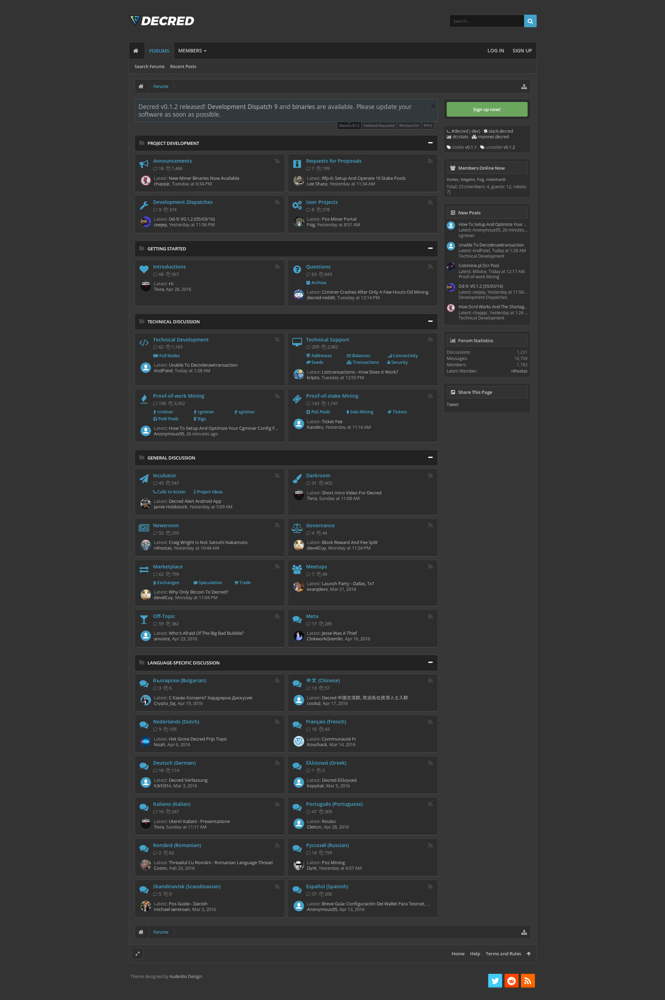
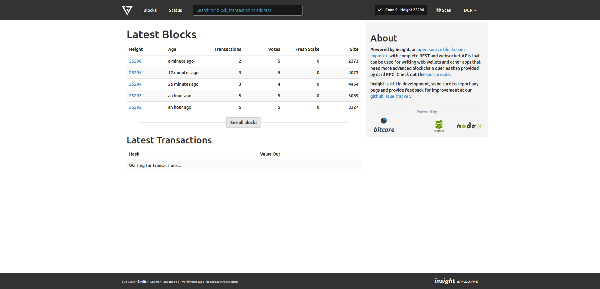
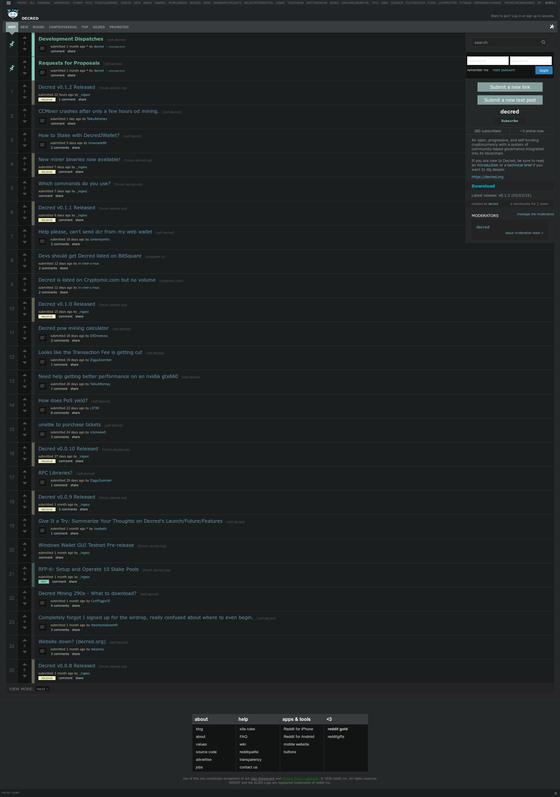
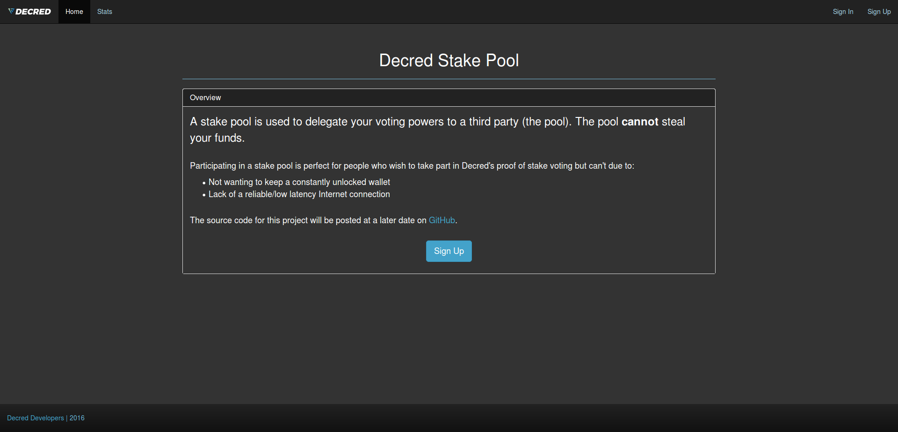
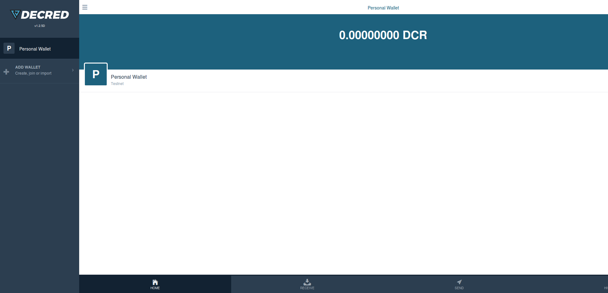
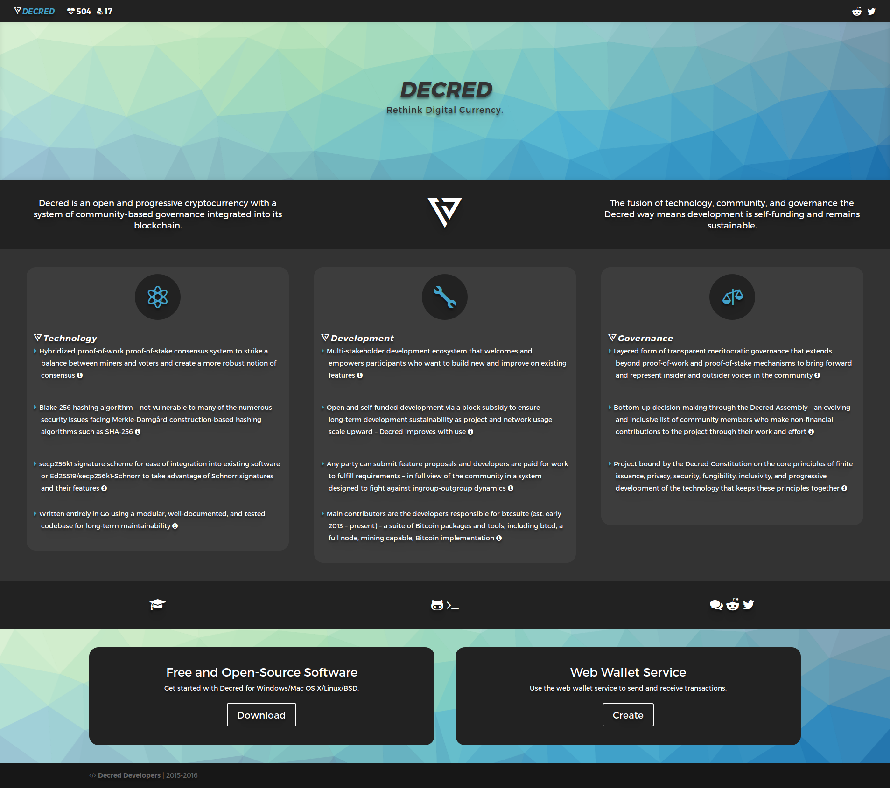

# Identity, Alignment, and Design

## Description
Decred needs to solidify a visual identity, align its different platforms in accordance with that identity, and redesign its landing site. This is important from a user experience perspective as the project continues to develop and mature.

## Requirements
Decred needs to solidify a visual identity, align its different platforms in accordance with that identity, and redesign its landing site. This is important from a user experience perspective as the project continues to develop and mature.

- Graphic design experience with references to prior work
- Web design experience with references to prior work

## Scope
Without a visual identity that represents Decred across different platforms, new and existing users may not always recognise it and feel disengaged with its identity. A professionally designed Decred identity brings longevity, togetherness, and representation for it both as a cryptocurrency and as a project in any environment.

Once an identity is established, alignment of different platforms with each other and with the Decred identity will be required. This will require modification of the different CSS components across the platforms listed (with screenshots) in Appendix A.

Finally, the main landing site for Decred requires redesign and implementation. A proposed foundation for the new landing site is the [Solid theme for Jekyll](http://jekyllthemes.org/themes/solid/), as it is blog-aware and includes relevant sections that allow for the showcasing of current and future Decred platforms as they develop. A screenshot of the current landing site is included in Appendix A.

## Estimated Work
4 weeks FTE or greater (1 FTE = 40 hrs/week).

## Proposal
Proposals should include:

- Description of your process in developing Decred's future identity
- Rough mockups of proposed color schemes and identity changes
- References to prior work on visual/web design projects
- Estimated completion time

## Milestones
Partial payments shall be made at the following milestones:

- Decred's identity has been reworked and redesigned
- The different Decred platforms have been aligned with each other through CSS and other web changes in accordance with the new identity
- The new Decred landing site has been designed and implemented

Modification of these proposed milestones is acceptable, and must be accompanied by sound reasoning in a proposal. Under no circumstances shall payments be made in advance of work being completed.

##Appendix A##
- https://docs.decred.org (forthcoming)
")

- https://forum.decred.org

- https://mainnet.decred.org

- https://reddit.com/r/decred

- https://stakepool.decred.org

- https://twitter.com/decredproject

- https://wallet.decred.org

- https://decred.org

