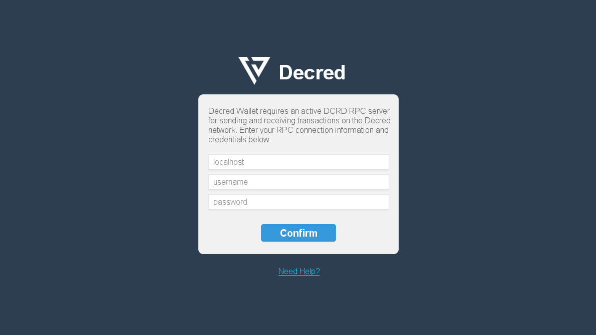
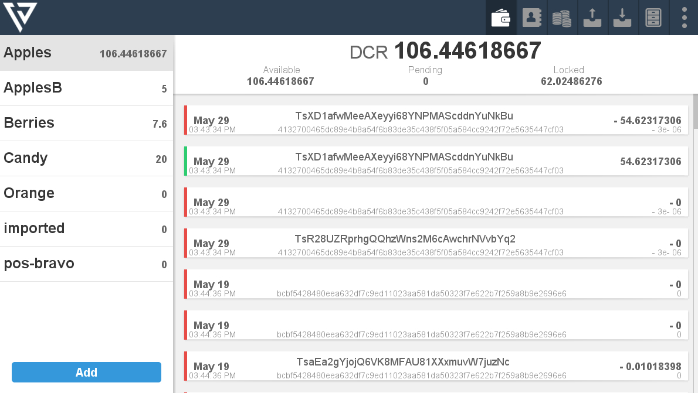
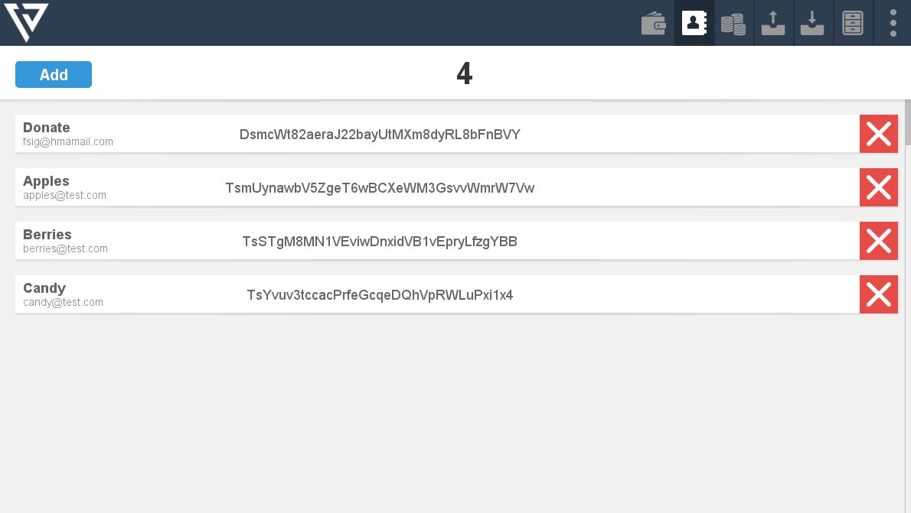
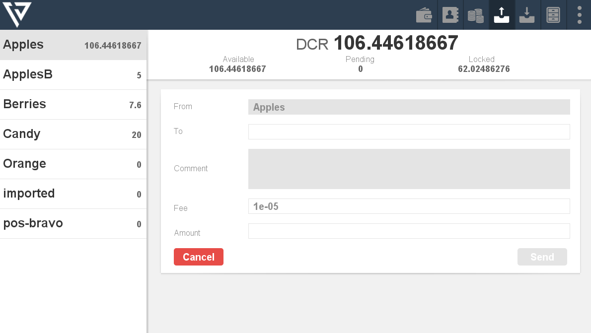
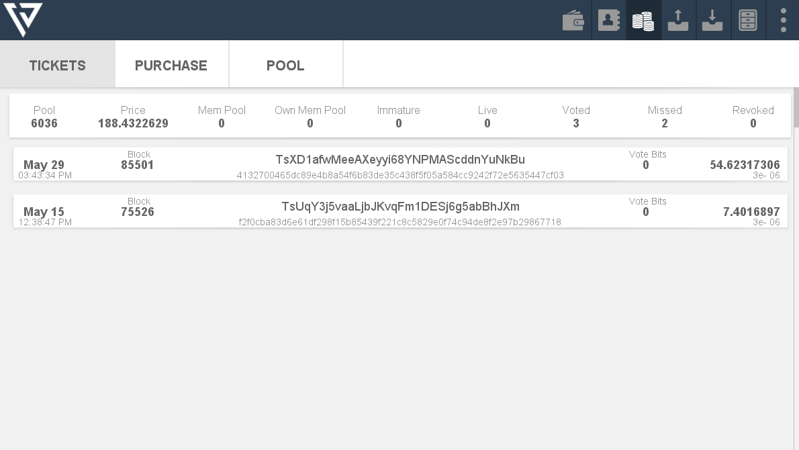
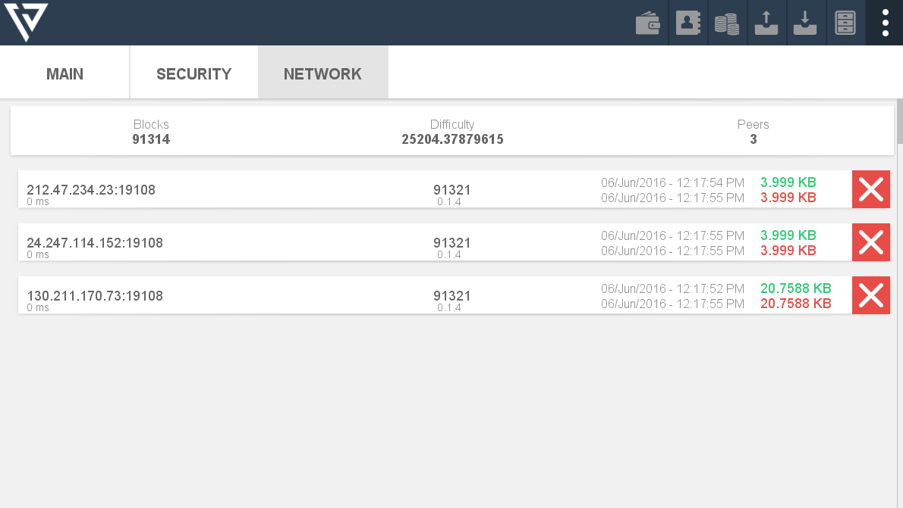

# Alternative GUI Implementation

## Description
A major priority area for Decred and the project is the development of a graphical user interface (GUI) for the Decred software. In order to address this need alongside the development taking place on RFP-1, another RFP is being opened to support a promising user project developing an alternative GUI. Progress on another affordable implementation will strengthen and speed up cross-platform accessibility as RFP-1's outcome is only for Windows at present. Given the priority of GUIs in expanding Decred's userbase, and improving accessibility in full for current users, multiple implementations are encouraged. Attached in Appendix A are screenshots of the current in progress implementation.

## Closing Date

All proposals must be submitted by 06:00 PM UTC June 16th, 2016.

## Requirements

* Technical familiarity with @Fsig's user project

## Scope

The user projects needs to be modified and expanded to include the following:

* Convert current API usage to JSON RPC
* Implement gRPC and use it where possible
* Login screen
* Keystore tool to find and add certificates to keystore or specified certificates
* Create wallet screen
* Scroll bars (UI)
* Redo stake screen (UI)
* Multiple addresses for payments (UI)
* Expandable transactions (UI)

## Estimated Work

3 weeks FTE or greater (1 FTE = 40 hrs/week).

## Proposal

Proposals should include:

* Description of the proposed changes
* References to prior work on Java projects (preferably open-source)
* Estimated completion time

## Milestones
Due to the limited scope of this RFP, there will not be any milestones. Payment in full will be made when the project modifications are completed. Modification of the proposed project modifications is acceptable, and must be accompanied by sound reasoning in a proposal. Under no circumstances shall payments be made in advance of work being completed.

##Appendix A##

